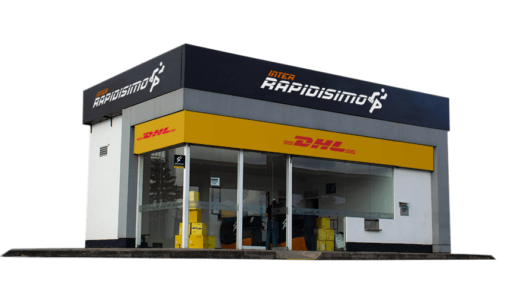
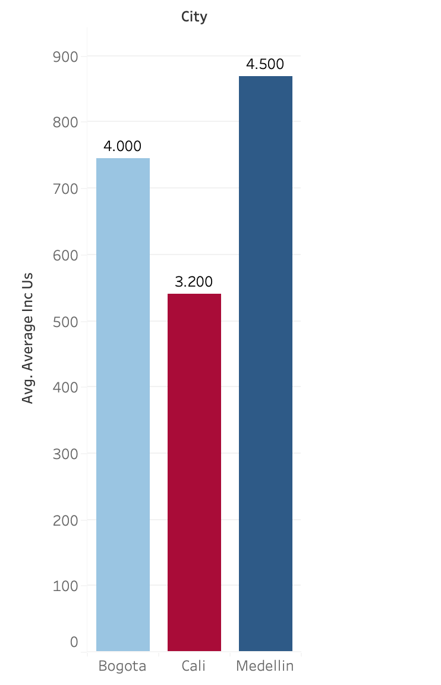
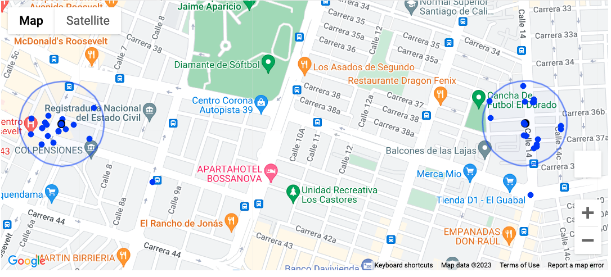
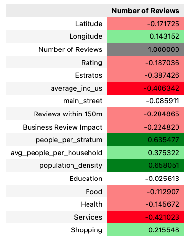
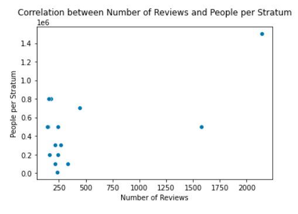
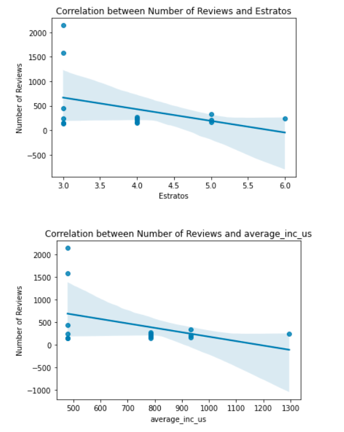
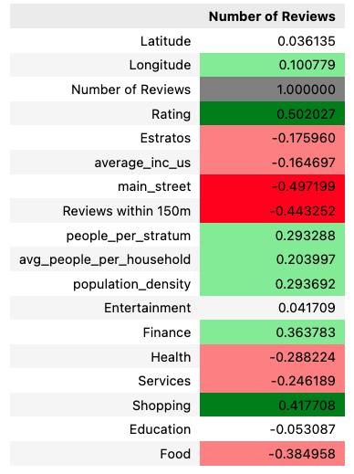
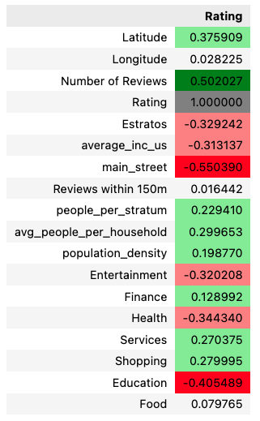

# Final-Project

## **Project Description: Finding the Best Location for Interrapidisimo in Cali, Colombia**

The primary objective of this endeavor is to locate the ideal site for a new Interrapidisimo branch in Cali, Colombia. The Colombian courier service Interrapidisimo operates several branches all over the nation. We have chosen to use the quantity of Google reviews and the average rating as key indicators of a franchise's success because specific business performance data is hard to come by in Colombia. Even though these elements might not cover every aspect that contributes to a franchise's success, we think that a high number of positive reviews and a respectable rating are excellent indicators of a successful franchise.

It's essential to remember that a customer is more apt to review and rate a business if they are extremely satisfied or extremely unsatisfied. We can, therefore, infer that a franchise with a high volume of favorable online encounters with clients tends to be more prosperous.

With this information in mind, we will analyze various factors, such as socio-economic stratum, population density, access to education, proximity to main streets, and the presence of nearby businesses, to find correlations that could impact the success of a new Interrapidisimo branch. We hope to offer data-driven suggestions for the ideal spot to launch a new Interrapidisimo in Cali, Colombia, by comprehending these correlations.

### **Exploring the Commercial Environment: How Business Surroundings Impact Success**

To get a better understanding of what makes a successful Interrapidisimo branch, I started by collecting data using Google Maps API. I focused on three major Colombian cities - Bogota, Medellin, and Cali - and created six data frames containing information about Interrapidisimo branches and their competitor, Servientrega. For each city, I had a data frame for both companies, including details like Name, Latitude, Longitude, Number of Reviews, and Address.

Now, finding demographic data in Colombia can be a bit tricky, so I had to think outside the box. I manually added socio-economic strata (Estratos) for each address, which helped me create a function to calculate the average income in US dollars for each stratum. This information was then added to my data frames in a new column called average_inc_us.

I realized the value of looking at the local business environment as I set out to comprehend the elements that contribute to a successful Interrapidisimo branch. The performance and customer base of a branch can be greatly impacted by the existence of different types of businesses nearby.

In order to look into this, I identified every sort of company within a 150-meter radius of each branch's location using the Google Maps API. I settled on a 150-meter radius because it's within easy walking distance of prospective clients and captures the surroundings that might persuade them to visit an Interrapidisimo branch.

By gathering this data, I hope to evaluate how each franchise's performance is impacted by the local business environment. This research will assist me in locating patterns and trends that may help me decide where to locate a new Interrapidisimo branch in Cali, Colombia. By taking into account both the demographics and the commercial dynamics of the region, I can optimize my decision to increase the chances of success for the new branch.

### **Unlocking the Secrets of Success: Exploring the Factors Driving Top-Performing Interrapidisimo Branches**

After merging the three Interrapidisimo data frames from the three cities, I embarked on an exciting journey to discover the secrets behind the top 15 branches, which I compiled into a new data frame called best_inter. I then dove deeper by adding intriguing details to the dataset.

I explored whether the franchise's location on a main street had any impact on its success. Venturing further, I analyzed the connection between the total number of reviews within a 150-meter radius around each Interrapidisimo branch and its performance. I was curious to uncover if thriving in a popular environment (in terms of reviews) could create a halo effect, driving new customers to the branch due to its proximity to other bustling businesses.

To bring the surroundings of each Interrapidisimo branch to life, I delved into demographic data by exploring captivating aspects like the average population per stratum , the number of households per square kilometer in the cities, and the average number of people per household within each stratum. This insightful information allowed me to calculate the average population density per stratum, providing a richer and more vivid understanding of the communities where the branches operate.

Armed with this wealth of knowledge, I set out to dissect the various factors that could potentially contribute to an Interrapidisimo branch's success. By understanding the dynamics of the surrounding businesses, demographic nuances, and location characteristics, I can make more informed decisions about the perfect spot for a new Interrapidisimo branch in Cali, Colombia, ultimately setting it up for a triumphant future.

### **Unlocking the Mysteries of Interrapidisimo Performance: A Dive into Correlations**

In order to conduct a more thorough investigation of possible correlations, I chose to create dummy variables for the different kinds of businesses that are located close to the Interrapidisimo branches. I was able to explore the complex connections between the commercial environment and the top-performing Interrapidisimo branches by conducting this analysis particularly for the best_inter data frame.

To achieve this, I created two correlation matrices - one based on the Number of Reviews and another on the Rating. This approach allowed me to examine the complex relationships between the performance of Interrapidisimo branches and various factors, such as the types of businesses in the surrounding area and demographic characteristics. 

   

 I observe an interesting negative correlation (-0.387426) between the number of reviews and socioeconomic class. This indicates that lower-stratum neighborhoods tend to have branches with more reviews, possibly as a result of these communities' higher population densities. In these busy areas, there is more opportunity for customer interaction, which fosters a favorable atmosphere for obtaining more reviews.

 Second, I discovered an intriguing negative correlation between the quantity of reviews and average salary (-0.406342). This result suggests that there is a greater need for inexpensive courier services like Interrapidisimo in low-income areas. As a result, the branches in these budget-conscious neighborhoods frequently get more positive feedback from clients who value the services they receive.

Finally, my research found a fascinating positive association (0.658051) between the quantity of reviews and population density. According to this correlation, branches located in densely populated areas are more likely to obtain positive reviews. These lively places are hubs for gathering customer input because of the increased foot traffic and customer interaction.

  

Based on the correlations observed scatter plot, it can be concluded that the success of Interrapidísimo franchises in Cali, Medellín, and Bogotá seems to be influenced by certain factors. The population density and presence in lower socioeconomic strata neighborhoods suggest that the demand for shipping services might be higher in these areas, which could explain the higher number of reviews. Additionally, the presence of fewer competitors and a lower concentration of services in the area could indicate that Interrapidísimo has a competitive advantage in these locations. 

  

 We can interpret the negative correlation found between the "Number of Reviews" and "Estratos" and "average_inc_us" variables as indicating that Intterapidísimo franchises located in areas with lower socioeconomic status and lower average income are more likely to receive more reviews. This could suggest that the franchise's pricing may be more appealing to customers in these areas, leading to more frequent use and more opportunities to leave reviews. Additionally, it may be easier for individuals or small businesses in lower-income areas to use Intterapidísimo for sending packages, leading to more reviews from those areas.

However, it is also important to consider that higher-income areas may have less need for post services like Intterapidísimo, leading to fewer reviews from those areas. Additionally, people in higher-income areas may have higher expectations for post services and may be more critical of any issues, leading to lower review scores.

Overall, the negative correlation between "Number of Reviews" and "Estratos" and "average_inc_us" suggests that Intterapidísimo franchises located in lower-income areas may be more successful in terms of customer satisfaction and review ratings. 

I chose to delve into the realm of the underperformers after learning the secrets of the Interrapidisimo branches with the best performance. This time, I took the risk of looking for relationships and trends among the 15 locations in Colombia that Interrapidisimo and their rival Servientrega both considered to be underperforming.

### **Underperforming Branches: A Comparative Study of Interrapidisimo and Servientrega"**

After exploring the secrets behind the top-performing Interrapidisimo branches, I chose to go into the world of the underperformers. This time, I took the chance of looking for relationships and trends among the 15 worst-performing branches of both Interrapidisimo and their competitor, Servientrega, in Colombia.

I wanted to find any underlying causes for both businesses' subpar performance, so I joined the data frames of the 15 branches with the lowest rankings. Using this strategy, I was able to make some fascinating comparisons and contrasts with the prosperous branches, offering insightful information that could help inform future choices for the expansion and development of Interrapidisimo's operations.

    

 Now we can better understand the factors that contribute to the subpar performance and learn important lessons to fuel future development by contrasting the worst-performing branches of both Interrapidisimo and Servientrega. Let's examine these weak branches and the connections we found in more detail now:

 Number of Reviews and Rating: The positive correlation (0.48) suggests that post offices with fewer visits (few reviews) tend to have a lower rating. However, as mentioned earlier, these post offices have already been classified as the worst in terms of performance.

Rating and location on main streets: The negative correlation (-0.56) suggests that post offices with poorer performance tend to be located off main streets. This could indicate that not being on a main street could be related to lower customer traffic and poorer performance.

Number of Reviews and location on main streets: The negative correlation (-0.51) suggests that post offices with fewer visits (few reviews) tend to be located off main streets. This supports the idea that not being on a main street could be related to lower customer traffic.

Number of Reviews and Food: The negative correlation (-0.46) suggests that post offices with fewer visits (few reviews) are located in areas with fewer food options. This could indicate that the presence of food establishments nearby could influence customer traffic.

Rating and Education: The negative correlation (-0.42) suggests that post offices with poorer performance could be located in areas with less access to education. Although this may not be directly related to customer traffic, it could have an indirect impact on service quality or customer expectations.

In summary, poorly performing and less-visited shipping franchises tend to be located off main streets and in areas with fewer food options. These characteristics could be related to customer traffic and post office performance.

### **Discovering the Ideal Location: A Success-Driven Approach for a New Interrapidisimo in Cali**

After conducting an exhaustive search, I discovered a promising location in Cali that embodies several of the characteristics found to be associated with positive results in our investigation. Moreover, this spot avoids the traits that could be linked to the underperformance of an Interrapidisimo branch and is free of direct competition in the area.

The chosen location boasts a high population density, is situated on a main street, and falls within a middle-low socio-economic stratum. In addition to these favorable factors, the site is conveniently located near shopping places and has no direct competition from other courier services. This combination of attributes aligns well with the insights gathered from our research, making this location a strong contender for a new and thriving Interrapidisimo branch in Cali, Colombia.

